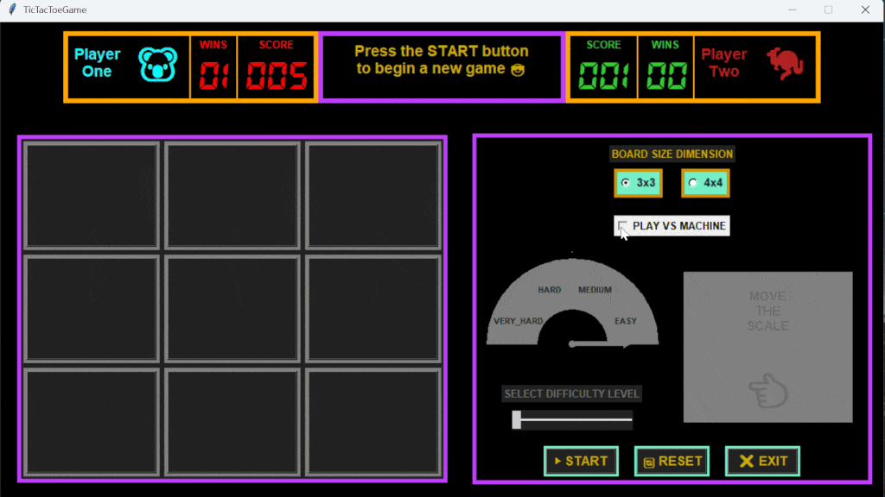
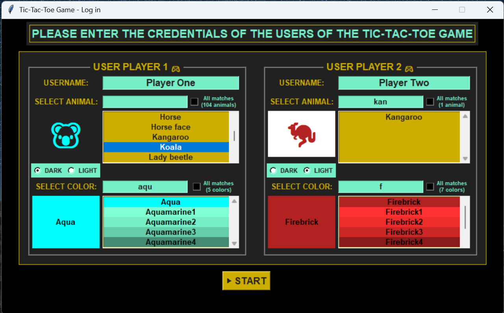
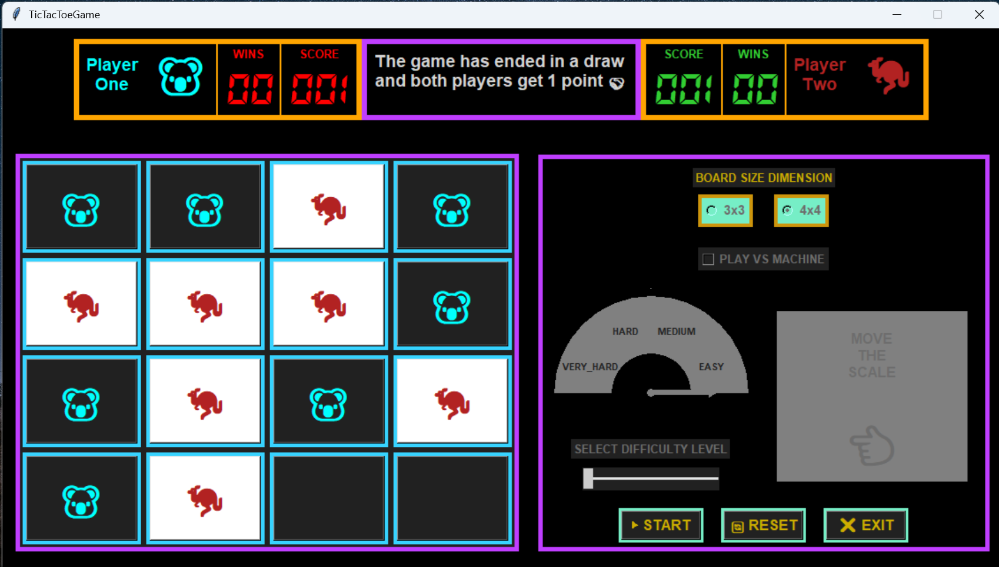
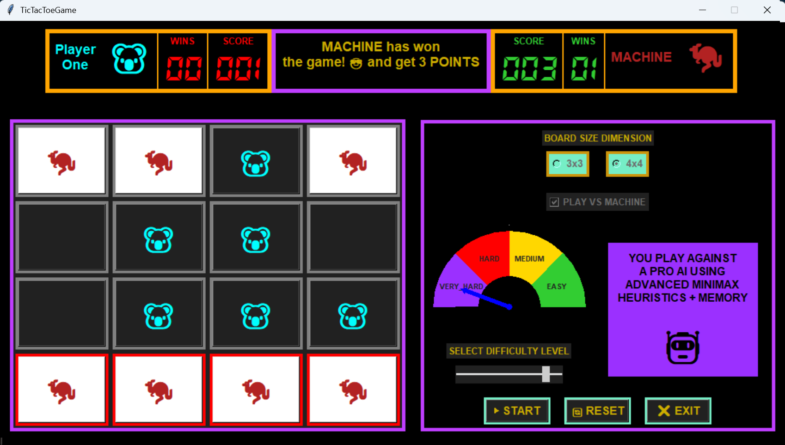

# 🧠 Tic Tac Toe with Smart AI (Python + Tkinter)

## 🎥 Live Demo

<p align="center">
  
</p>

---

## 📸 Screenshots

<p align="center">
  
  
  
</p>

---

<p align="center" style="margin-top: 1rem;">
  <a href="../LICENSE" style="margin-right: 20px; text-decoration:none;">
    
  </a>
  <a href="https://www.python.org/" style="margin-right: 20px; text-decoration:none;">
    
  </a>
  <a href="https://github.com/AndrewTeleco/tic_tac_toe_ai/actions/workflows/python-app.yml" style="margin-right: 20px; text-decoration:none;">
    
  </a>
  <a href="https://github.com/AndrewTeleco/tic_tac_toe_ai" style="text-decoration:none;">
    
  </a>
</p>

---

This is a complete **Tic Tac Toe** game built in Python with a `tkinter` GUI. The game supports both **human vs human** and **human vs AI** modes, with several difficulty levels ranging from easy to a very challenging opponent powered by advanced heuristics and alpha-beta pruning.

## 🎮 Key Features

- ✅ Supports both **3x3 and 4x4** boards
- ✅ Supports AI with 4 levels: **EASY, MEDIUM, HARD, VERY HARD**
- ✅ Supports **Minimax algorithm** with alpha-beta pruning and scoring heuristics
- ✅ Supports match logging and a **ranking system** for top players
- ✅ Supports custom difficulty sliders and full GUI control
- ✅ Supports ANSI colors in console (Linux/Unix friendly)
- ✅ Highly **modular and maintainable** codebase

---

## 🧩 Game Logic Overview (TicTacToeLogic)

The logic is designed to be modular and cleanly separated from the UI, facilitating easy maintenance and future expansions.

The core game mechanics are implemented in the `TicTacToeLogic` class, which handles:

- **Player and turn management:** Tracks whose turn it is, switches turns, and manages player identities.
- **Move validation:** Ensures moves are legal and on empty board cells.
- **Board state management:** Maintains the current state of the board for both 3x3 and 4x4 modes.
- **Win and tie detection:** Checks after every move if a player has won or if the board is full (tie).
- **Score and ranking updates:** Updates player scores and tracks wins throughout multiple games.
- **AI integration:** Interfaces with the AI player to provide moves at different difficulty levels.
- **Game flow control:** Handles resetting the board, starting new games, and switching game modes.

---

## 🖥️ Main GUI and Helper Utilities

- **TicTacToeGame**: Main application window managing the full GUI, including the board display, player info panels, buttons, and difficulty selectors. It orchestrates user interaction and links the UI with the game logic and AI.

- **DisplayGame**: Manages the visual display of player information including names, symbols, scores, and wins. Also handles the central message panel for game status updates and blinking messages. It keeps the UI dynamic and synchronized with the game logic.

- **BoardGame**: This module manages the visual game board in the Tic Tac Toe interface. It constructs an N x N grid of interactive buttons and responds to game state changes by updating cell visuals, highlighting winning combinations, and resetting the grid for new rounds.

- **ButtonsPanel**: Manages the restart, reset, and exit buttons within the GUI, handling user input events and communicating commands to the main game controller.

- **DifficultyPanel**: Provides a semicircular difficulty selector allowing players to choose between four AI levels (EASY to VERY HARD). It handles difficulty state, visual highlighting, and notifies the main game when the selection changes.

- **RankingTopPlayers**: Handles player rankings and statistics persistence using shelve. It loads and updates player scores and wins, formats a color-coded leaderboard with top players highlighted, and provides interfaces to access ranking data for UI display or console output.

Example Console Output of the Ranking:

```
--------------------------------- 😎 TOP PLAYERS LIST 😎 --------------------------------
|____POS____|________USER________|____GAMES____|____WINS____|____SCORE____|_____RATE_____|
|     1     |     username_1     |     026     |     09     |     037     |   34.62 %    |
|     2     |      MACHINE       |     026     |     07     |     031     |   26.92 %    |
|     3     |     username_2     |     000     |     00     |     000     |    0.0 %     |
------------------------------------------------------------------------------------------
```

- **LogGame**: Implements the logging system for all major game events. It supports output to the console, file, or both, with color-coded and timestamped entries. Events like moves, wins, ties, resets, and game starts are logged with a snapshot of the current board grid. Logs can be exported as `.txt` files in a structured format inside the `/LOGS` directory.

Example Console Output:

```
|TIME: 2025-07-18 18:38:06|
|EVENT: The game has ended in a match and both players get 1 point 🤝|
|GRID| +----+ +----+ +----+ +----+
       | 🐉 | |    | | 🐉 | | 🐬 |
       +----+ +----+ +----+ +----+
       |    | | 🐉 | | 🐬 | |    |
       +----+ +----+ +----+ +----+
       | 🐬 | | 🐬 | | 🐬 | | 🐉 |
       +----+ +----+ +----+ +----+
       | 🐉 | | 🐉 | | 🐬 | | 🐉 |
       +----+ +----+ +----+ +----+
```

- **enums.py**: Centralizes all enumeration classes used throughout the project, including difficulty levels, UI label types, action buttons, and widget key identifiers, enhancing modularity and clarity.

- **helper_classes.py**: Contains helper classes and named tuples that support UI elements, game entities, exceptions, and configuration structures to improve code readability and maintainability.

- **helper_methods.py**: A collection of utility functions supporting board serialization, positional scoring heuristics, symmetry detection, and AI boost scoring. These reusable helpers improve modularity throughout the codebase.

- **literals.py**: Contains global constants such as colors, fonts, and text strings used throughout the application for consistent configuration.

---

## 🔐 User Configuration Module (user_config/)

This module handles user login and credentials setup, ensuring valid player identities before the game starts. It consists of:

- **user_credentials_gui.py**: (UserCredentialsGUI)  
  The main login window where players enter their usernames and select an animal (with emoji) and a color.  
  It builds the full GUI layout and manages widget creation.

- **user_credentials_callbacks.py**: Handles all interactive events (text entry updates, listbox selections, checkbutton/radiobutton toggles) and refreshes the GUI dynamically.

- **user_credentials_storage.py**: Loads the available animals and colors, saves selected credentials, and records logs of the login session.

- **user_credentials_validator.py**: Provides validation of all user inputs, ensuring no duplicates or invalid entries, and enforces rules for animal and color selection.

---

## 🤖 AI Difficulty Levels

| Level     | Description                                                          |
| --------- | -------------------------------------------------------------------- |
| EASY      | Completely random moves 😄                                           |
| MEDIUM    | Basic Minimax without pruning, with chance of random mistakes 🤔     |
| HARD      | Minimax with alpha-beta pruning and deeper logic 😨                  |
| VERY HARD | Full Minimax with heuristics, strategic scoring, and time control 🤖 |

---

## 📐 Project Structure

```
tic_tac_toe/
│
├── ai/              # AI logic and player ranking
│   ├── ai_player.py
│   └── ranking_top_players.py
│
├── core/            # Core logic, helpers, enums, constants, logging
│   ├── enums.py
│   ├── helper_classes.py
│   ├── helper_methods.py
│   ├── literals.py
│   ├── log_game.py
│   ├── logic_game.py
│   └── paths.py
│
├── data/            # Persistent data and logs
│   ├── credentials.shlv
│   ├── ranking_top_players.shlv
│   └── logs/
│
├── gui/             # GUI modules and main window
│   ├── board_game.py
│   ├── buttons_panel.py
│   ├── difficulty_panel.py
│   ├── display_game.py
│   └── tic_tac_toe_game.py
│
├── user_config/     # User credentials management
│   ├── Animals.md
│   ├── Colors.md
│   ├── user_credentials_callbacks.py
│   ├── user_credentials_gui.py
│   ├── user_credentials_storage.py
│   └── user_credentials_validator.py
│
├── docs/            # Documentation and assets
│   ├── assets/
│   │   ├── tic_tac_toe_demo.gif
│   │   ├── tic_tac_toe_login.png
│   │   ├── tic_tac_toe_game.png
│   │   └── tic_tac_toe_vs_machine.png
│   │
│   ├── README_EN.md
│   └── README_ES.md
│
├── tests/           # Tests and demo scripts
│   └── main.py
│
├── LICENSE          # License file
├── README.md        # Main README
├── main.py          # Application entry point
├── .gitignore       # Git ignore rules
└── requirements.txt # Python dependencies (optional)

```

## 📐 UI Layout (Diagrams)

### 🔐 UserCredentialsGUI Layout (Login Window)

Diagram of the login GUI where each player configures their credentials:

```
┌──────────────────────────────────────────────────────────────────────┐
│               MAIN LOGIN WINDOW (UserCredentialsGUI)                 │
│                                                                      │
│  ┌────────────────────────────┐   ┌────────────────────────────┐     │
│  │       PLAYER 1 Section     │   │       PLAYER 2 Section     │     │
│  │  Username | Animal | Color │   │  Username | Animal | Color │     │
│  │  [Entries | Lists | Radios]│   │  [Entries | Lists | Radios]│     │
│  └────────────────────────────┘   └────────────────────────────┘     │
│                                                                      │
│                      [ Button: "Start Game" ]                        │
└──────────────────────────────────────────────────────────────────────┘

```

### 🎮 TicTacToeGame Layout (Main Window)

Diagram of the full GUI layout, showing how all the major frames and panels are arranged.

```
┌──────────────────────────────────────────────────────────────────────┐
│                   MAIN GAME WINDOW (TicTacToeGame)                   │
│                                                                      │
│  ┌────────────────────────────────────────────────────────────────┐  │
│  │                WHOLE Frame: self.frames[WHOLE]                 │  │
│  │                                                                │  │
│  │    ┌────────────────────────────────────────────────────┐      │  │
│  │    │        DISPLAY Frame: self.frames[DISPLAY]         │      │  │
│  │    │     ┌──────────┐ ┌────────────┐ ┌──────────┐       │      │  │
│  │    │     │ Player 1 │ │   Message  │ │ Player 2 │       │      │  │
│  │    │     └──────────┘ └────────────┘ └──────────┘       │      │  │
│  │    └────────────────────────────────────────────────────┘      │  │
│  │                                                                │  │
│  │ ┌────────────────────┬───────────────────────────────────────┐ │  │
│  │ │    BOARD Frame:    │      CONFIGURATION_PANEL Frame:       │ │  │
│  │ │                    │    self.frames[CONFIGURATION_PANEL]   │ │  │
│  │ │ self.frames[BOARD] │ ┌───────────────────────────────────┐ │ │  │
│  │ │                    │ │ BUTTONS_PANEL Frame:              │ │ │  │
│  │ │                    │ │     self.frames[BUTTONS_PANEL]    │ │ │  │
│  │ │    (BoardGame)     │ │     (ButtonsPanel)                │ │ │  │
│  │ │                    │ │ - Radiobuttons (3x3 / 4x4)        │ │ │  │
│  │ │                    │ │ - Checkbutton (vs machine)        │ │ │  │
│  │ │ N x N grid buttons │ │ - Difficulty semicircle (panel)   │ │ │  │
│  │ │                    │ │ - Buttons (Start, Reset, Exit)    │ │ │  │
│  │ │                    │ └───────────────────────────────────┘ │ │  │
│  │ └────────────────────┴───────────────────────────────────────┘ │  │
│  └────────────────────────────────────────────────────────────────┘  │
└──────────────────────────────────────────────────────────────────────┘
```

### 🛠️ ButtonsPanel Layout (Configuration Panel)

This shows the internal structure of the ButtonsPanel, which includes board size options, game mode toggle, difficulty selector, and main game buttons.

```
┌──────────────────────────────────────────────┐
│               ButtonsPanel                   │
│  (tk.Frame - contains all configuration UI)  │
│                                              │
│  ┌────────────────────────────────────────┐  │
│  │     Board Size Selector (Radiobuttons) │  │
│  │  ┌──────────────────────────────────┐  │  │
│  │  │ Label: "Board Size Dimension"    │  │  │
│  │  └──────────────────────────────────┘  │  │
│  │            [ 3x3 ]  [ 4x4 ]            │  │
│  └────────────────────────────────────────┘  │
│                                              │
│  ┌────────────────────────────────────────┐  │
│  │      Game Mode Toggle (Checkbutton)    │  │
│  │          [✓] Play vs Machine           │  │
│  └────────────────────────────────────────┘  │
│                                              │
│  ┌────────────────────────────────────────┐  │
│  │      Difficulty Selector Panel         │  │
│  │  ┌──────────────────────────────────┐  │  │
│  │  │    Semicircle Difficulty UI      │  │  │
│  │  │      EASY   MEDIUM   HARD        │  │  │
│  │  └──────────────────────────────────┘  │  │
│  └────────────────────────────────────────┘  │
│                                              │
│  ┌────────────────────────────────────────┐  │
│  │            Action Buttons              │  │
│  │         START   RESET   EXIT           │  │
│  └────────────────────────────────────────┘  │
└──────────────────────────────────────────────┘
```

## 🚀 How to Run

### Prerequisites

- Python 3.10 or newer
- `tkinter` installed (usually bundled with Python)
- Git (optional, for cloning repo)

### Installation

```bash
git clone https://github.com/AndrewTeleco/tic_tac_toe_ai.git
cd tic_tac_toe
pip install -r requirements.txt  # Optional, only if you add dependencies later
```

### Running the Game

```bash
python3 main.py
```

💡On Windows, replace python3 with python.

---

## 🧪 Project Status

The project is in the final optimization and review phase.  
All major components have been carefully implemented and evaluated with high quality.
The AI strategies and GUI interface are stable and polished, ready for deployment and open-source release.

---

## 🛠️ Future Improvements

- Add networked multiplayer mode
- Implement more advanced AI strategies
- Improve GUI responsiveness and animations
- Expand ranking system with player profiles

---

## 🤝 Contributing

Contributions are very welcome! Please follow these guidelines:

- Fork the repository and create your branch (git checkout -b feature/your-feature)
- Commit your changes with clear messages (git commit -m "Add feature XYZ")
- Push to your branch (git push origin feature/your-feature)
- Open a Pull Request describing your changes

Please maintain code style consistency and include tests for new features if possible.

---

## 🛠️ FAQ & Troubleshooting

Q: What if tkinter is not installed?
A: On Linux, run sudo apt-get install python3-tk (Debian/Ubuntu) or equivalent.
On Windows/macOS, tkinter usually comes bundled with Python.

Q: How do I change the AI difficulty?
A: Use the difficulty semicircle selector on the main game window before starting a match.

Q: Where are the logs saved?
A: Logs are saved as .md files inside the /data/logs directory.

---

## ⭐ Did you like this project?

If you found this project interesting or useful, consider giving it a **star on GitHub**!  
It helps me continue creating high-quality projects and motivates me to keep improving.

<p align="center">
  <a href="https://github.com/AndrewTeleco/tic_tac_toe_ai" target="_blank">
    
  </a>
</p>

## 👤 Author

**Andrés David Aguilar Aguilar**  
GitHub: [@AndrewTeleco](https://github.com/AndrewTeleco)
📅 July 2025

---

## 📄 License

This project is licensed under the **MIT License – Modified for Non-Commercial Use**.

You are free to use, modify, and distribute the code for non-commercial purposes.
For commercial licensing, please contact the author.

See full license in the [LICENSE](../LICENSE) file.
